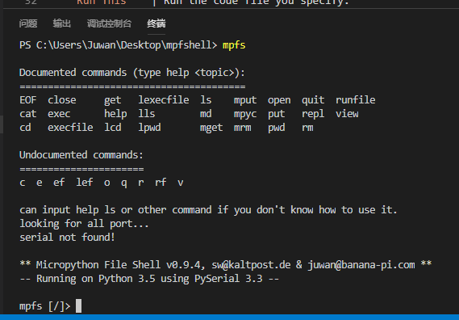
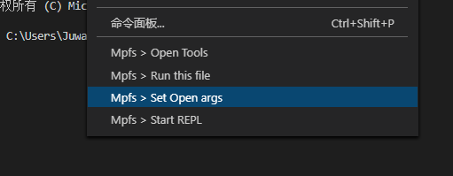
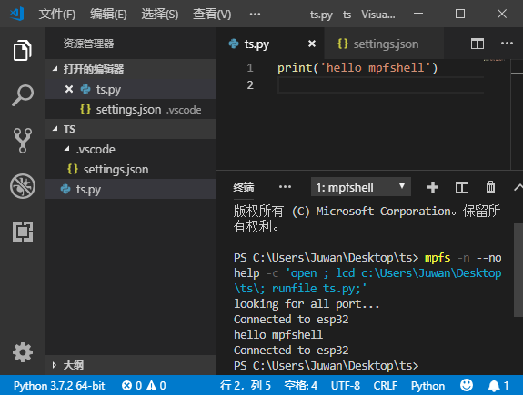
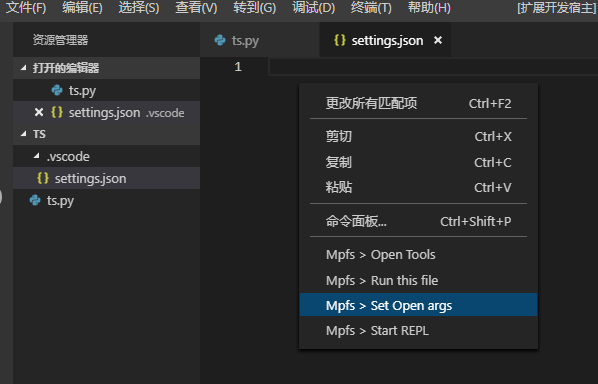
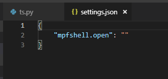
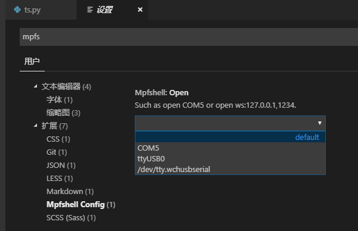

# Mpfshell extension for Visual Studio Code

&emsp;&emsp;&emsp;&emsp;&emsp;&emsp;&emsp;&emsp;&emsp;&emsp;&emsp;&emsp;&emsp;&emsp;&emsp;&emsp;&emsp;&emsp;&emsp;&emsp;&emsp;See this [mpfshell](https://github.com/wendlers/mpfshell).


## features

1. Based on the [mpfshell-lite](https://github.com/BPI-STEAM/mpfshell-lite).

2. Start your Python and MicroPython programming anytime, anywhere.

3. Right - click shortcuts to control your board.

## Quick start

* **Step 1.** Install [Python 3.5.4](https://www.python.org/downloads/release/python-354/) +
* **Step 2.** Install [mpfshell-lite](https://github.com/BPI-STEAM/mpfshell-lite).
* **Step 3.** Open or create a Python file and start coding!

In the terminal input `mpfs` into the following mode shows you already installed.



## All functions menu



## Useful commands
Open the Command Palette (Command+Shift+P on macOS and Ctrl+Shift+P on Windows/Linux) and type in one of the following commands:

Command | Description
--- | ---
```Set Open args``` |  Set args of the Open, save configuration file.
```Start REPL``` | directly into your MicroPython REPL.
```Run this file``` | Run the code file you specify.
```Open Tools``` | directly into  mpfshell equivalent.

To see all available Python commands, open the Command Palette and type ```mpfshell```.

## How to execute **xx.py** ?

To execute a **xx.py** file, you need to right-click and select `Run this file`.

The terminal will be the following result.



such as `mpfs > runfile ts.py`.

## How to config open args



### in workspace

It will generate `settings.json`



```json
{
    "mpfshell.open": ""
}
```

This is actually the open argument to the mpfshell.

You can change it if your Want to use webrepl.
```json
{
    "mpfshell.open": "ws:192.168.1.1,1234" // mpfs > open ws:192.168.1.1,1234.
}
```

### in folder



It will be saved in the workspace configuration, and each run this code will be asked `Set open args` if value is default or auto judge.

## Supported locales

Near future.
